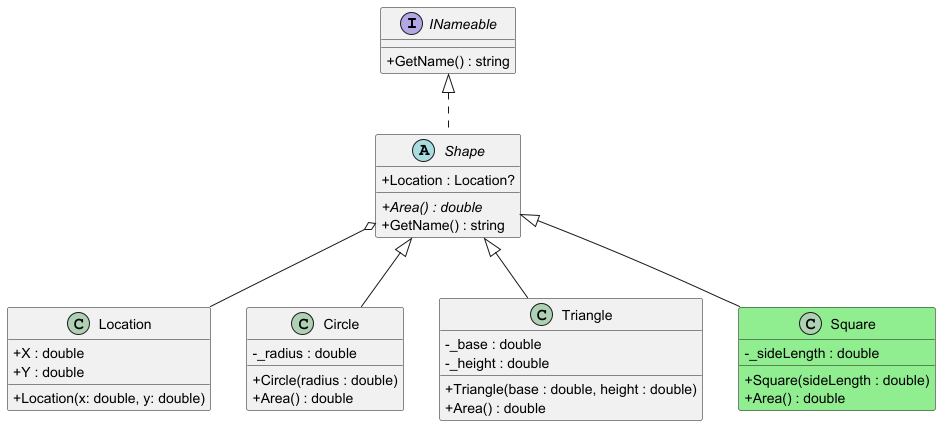

# Assignment: Extending the Shape Hierarchy

## Objective

Your task is to extend the existing object-oriented shape hierarchy by implementing a `Square` class.

## Requirements

1.  **Create the `Square` Class:**
    *   The `Square` class must inherit from the `Shape` abstract class.
    *   It should correctly implement the `Area()` method.
    *   Follow the existing patterns in the `Circle` and `Triangle` classes for guidance.

2.  **Update the Main Program:**
    *   In `Program.cs`, instantiate your `Square` class with a side length of `2.0`.
    *   Add the new `square` object to the `shapes` and `names` lists to ensure it is included in the program's output.

## Class Diagram

The following diagram illustrates the target class structure. Your goal is to implement the `Square` class as shown.



## Expected Output

After correctly implementing the `Square` class and updating the `Program.cs` file, running the application should produce the following console output:

```
Area of Circle = 3.141592653589793
Area of Triangle = 1
Area of Square = 4
Circle
Triangle
Samson
Square
```

