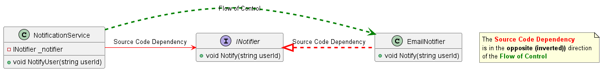

## In-class Assignment: Dependency Inversion Principle

### Introduction
In the given starting code, the `NotificationService` class is violating several SOLID principles. It violates the Single Responsibility Principle because it is instantiating a concrete `EmailNotifier` instance, a responsibility that should be delegated elsewhere. It also violates the Dependency Inversion Principle and, consequently, the Open/Closed Principle, because it is tightly coupled to the concrete `EmailNotifier` class, making the system less modular and extendable.

In this assignment, we will work on refactoring the code to adhere to the SOLID principles, specifically focusing on applying the Dependency Inversion Principle to make the system more flexible and maintainable.

### Before


### After


### Instructions

1. Start by identifying the behaviors in `EmailNotifier` class that can be extracted to an interface. Create an interface called `INotifier` with a method signature that matches the notification functionality in `EmailNotifier`.

2. Update the `EmailNotifier` class to implement the newly created `INotifier` interface. Make sure to rename the method in `EmailNotifier` to `Notify` to match the method defined in `INotifier`.

3. In the `NotificationService` class, replace the direct instantiation of `EmailNotifier` with an `INotifier` field. Adjust the constructor of `NotificationService` to accept an `INotifier` parameter and use it to initialize the field.

4. Update the `Main` method to create an instance of `EmailNotifier` and pass it to the `NotificationService` through its constructor. Here is the updated `Main` method for your reference:

    ```csharp
    private static void Main()
    {
        var emailNotifier = new EmailNotifier();
        var notificationService = new NotificationService(emailNotifier);

        notificationService.NotifyUser("123");
    }
    ```

5. Once all updates are made, run the `Main` method to verify that the code is working as expected and adhering to the SOLID principles.

### Note on Naming the Interface
When naming the interface, we chose a more general and abstract name, `INotifier`, instead of something more specific like `IEmailNotifier`. This decision allows for the possibility to use the interface for other types of notifications, such as SMS, in the future, thereby adhering to the Open/Closed Principle by allowing extension without modification.

### Conclusion

By following the steps above, you would have refactored the code to comply with the Dependency Inversion Principle, thus making it more flexible and maintainable while ensuring adherence to the SOLID principles.