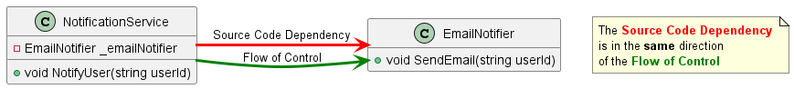

### In-Class Assignment: Interface Segregation Principle

In the initial code, you have a single interface `IMusicApp` that is implemented by both the `AdvancedMusicPlayer` and `BasicMusicPlayer` classes. This forces the `BasicMusicPlayer` class to have methods that it doesn't use, which violates the Interface Segregation Principle. Your task is to refactor the code to adhere to this principle, focusing on assigning names that accurately represent the behaviors they are meant to model.

#### Before


#### After


#### Step-by-Step Guide

1. **Analysis**: Start by understanding the existing structure where the `IMusicApp` interface is being implemented by both `BasicMusicPlayer` and `AdvancedMusicPlayer`.

2. **Interface Segregation**:

    - **Identify Behaviors**: Before creating new interfaces, identify the different behaviors that are being represented in the `IMusicApp` interface.

    - **Create New Interfaces**: Create two separate interfaces named `ITrackPlayer` and `IPlaylistCreator` to represent these behaviors more accurately.
        - **`ITrackPlayer`**: Should contain the method signature: `void PlayTrack(string trackId);`. You can copy this method from the `IMusicApp` interface.
        - **`IPlaylistCreator`**: Should contain the method signature: `void CreatePlaylist(string playlistName);`. You can copy this method from the `IMusicApp` interface.

3. **Refactor Classes**:

    - **`BasicMusicPlayer`**: Should now implement only the `ITrackPlayer` interface. Remove any methods that are not part of this interface.
    - **`AdvancedMusicPlayer`**: Should implement both `ITrackPlayer` and `IPlaylistCreator` interfaces. Ensure it contains methods that satisfy both interface contracts.

4. **Update Main Method**:

    - **Demonstrate Behaviors**: Update the `Main` method to demonstrate that each class correctly implements its respective behaviors. Here is how your main method should look:

    ```csharp
    private static void Main()
    {
        ITrackPlayer basicPlayer = new BasicMusicPlayer();
        var advancedPlayer = new AdvancedMusicPlayer();

        basicPlayer.PlayTrack("123"); // This should work fine

        advancedPlayer.PlayTrack("456"); // This should work fine
        advancedPlayer.CreatePlaylist("MyAdvancedPlaylist"); // This should work fine
    }
    ```
### Note
When determining the names for your interfaces, consider representing the actions or behaviors that the classes "can do," rather than an "is a" relationship that typically comes with inheritance.

Initially, you might be tempted to use names that denote different levels of hierarchy, such as `IBasicMusicApp` or `IAdvancedMusicApp`. These names might suit an inheritance scenario where you have an "is a" relationship. However, with interfaces, we are describing what a class "can do," therefore names like `ITrackPlayer` and `IPlaylistCreator` are more apt as they clearly indicate the actions a class is capable of performing, enhancing readability and maintainability in the process.


#### Success Criteria
- You have successfully segregated the `IMusicApp` interface into two logical interfaces: `ITrackPlayer` and `IPlaylistCreator`.
- The `BasicMusicPlayer` class is not forced to implement methods that it doesn't use, complying with the Interface Segregation Principle.
- The application runs without errors, demonstrating the correct implementation of both interfaces by the `AdvancedMusicPlayer`.

Run the updated `Main` method to verify that you achieve the expected output. Good luck!
