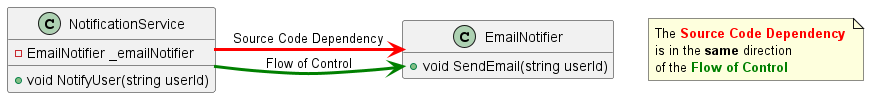
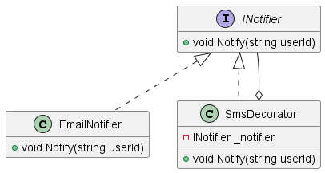

### Programming Quiz

#### Objective
Your task is to enhance the notification system using the Decorator Pattern. You need to create a `LoggingNotifierDecorator` class which will add logging functionality to any class implementing `INotifier`.

### Before

### After

#### Instructions

1. Create a class named `LoggingNotifierDecorator` that implements the `INotifier` interface.
2. Add a private readonly field of type `INotifier` and a constructor to initialize this field.
3. Implement the `Notify` method in `LoggingNotifierDecorator` such that it:
    - Calls the `Notify` method of the original notifier (passed through the constructor)
    - Logs a message to the console indicating that a notification has been sent (after calling the original notifier's method).
4. In the `Main` method:
    - Create an instance of `LoggingNotifierDecorator`, passing the `EmailNotifier` as a parameter to its constructor.
    - Call the `Notify` method on the `LoggingNotifierDecorator` instance.

#### Requirements
- Do not modify the `INotifier` and `EmailNotifier` classes.
- The log message should be in the format: "Log: Notification has been sent to user: {userId}".

#### Submission
Submit visual studio project as a zip file.
